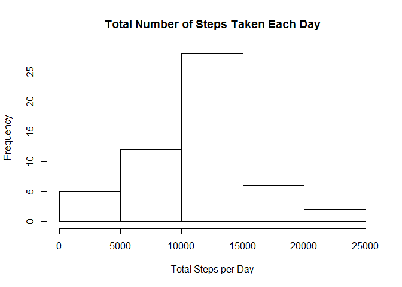
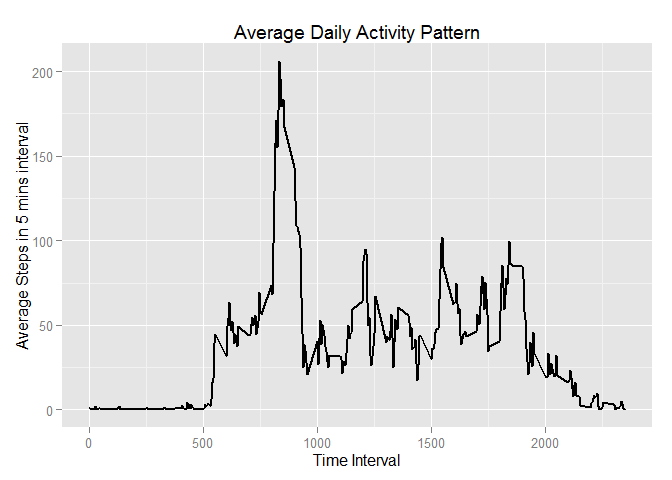
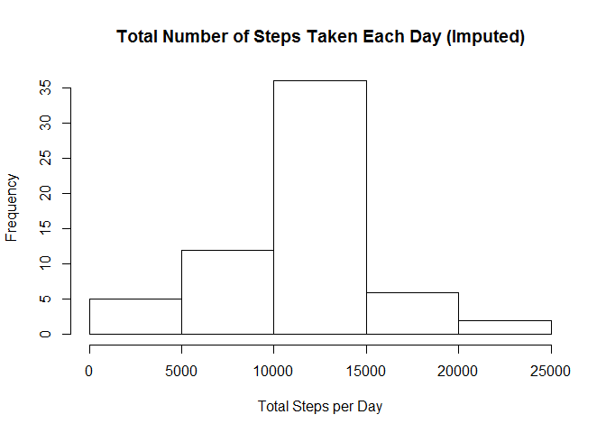
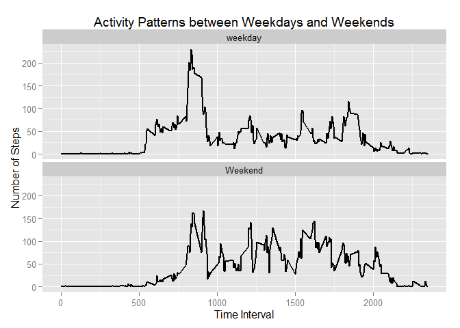

# Reproducible Research: Peer Assessment 1


## Loading and preprocessing the data
Load the data and change date factor to Date

```r
setwd("C:/Users/rache_000/Desktop/Coursera")
data <- read.csv("activity.csv", header =TRUE, na.strings="NA")
data$date <- as.Date(data$date)
```

## What is mean total number of steps taken per day?
* Calculate the total number of steps taken per day 
* then create a histogram of the total number of steps taken each day

```r
totalSteps <- aggregate(steps ~ date, data, sum, na.rm= TRUE)
hist(totalSteps$steps, main=paste("Total Number of Steps Taken Each Day"), xlab ="Total Steps per Day")
```

 

Report the mean and median of total number of steps taken per day

```r
stepsMean <- mean(totalSteps$steps)
stepsMedian <- median(totalSteps$steps)
```
The `mean` is 10766.1886792

The `median` is 10765

## What is the average daily activity pattern?
* Make a time series plot of the 5 minute interval and average number of steps taken
* Print which 5-minute interval, on average across all the days in the dataset, contains the maximum number of steps 

```r
avgActivity <- aggregate(steps ~ interval, data, mean, na.rm=TRUE)

ggplot(avgActivity, aes(x=interval, y=steps)) + geom_line(lwd=1) + ggtitle("Average Daily Activity Pattern") + xlab("Time Interval") + ylab("Average Steps in 5 mins interval")
```

 

```r
maxActivity <- avgActivity[which.max(avgActivity$steps),]$interval
```
In 5-minute interval, on average across all the days in the dataset, containing the max number of steps is 835

## Imputing missing values
* Report the total number of missing values
* Fill in the missing values by inserting the mean value for that 5 min interval
* Create new dataset for the missing data filled in
* Make a histogram of the total number of steps taken each day
* Calculate mean and median

```r
missing <- sum(is.na(data$steps))
```
Total Number of Missing Values is 2304


```r
# fill in the missing values
for(i in 1:nrow(data)) {
        if(is.na(data[i,]$steps)) {
                data[i,]$steps <- avgActivity[data[i,]$interval==avgActivity$interval,]$steps
        }
}


imputedSteps <- aggregate(steps ~ date, data, sum)
# make a histogram
hist(imputedSteps$steps,main=paste("Total Number of Steps Taken Each Day (Imputed)"), xlab ="Total Steps per Day")
```

 

```r
imputedMean <- mean(imputedSteps$steps)
imputedMedian <- median(imputedSteps$steps)        
```
`Imputed Mean` value is 10766.1886792

`Imputed Median` value is 10766.1886792

Previously,
the `mean` was 10766.1886792
and the `median` was 10765

Overall, the mean stayed the same but the median increased slightly.

## Are there differences in activity patterns between weekdays and weekends?
* create a new factor variable with weekday and weekend
* Make a time series plot of the 5 minutes interval and average number of steps taken, averaged across all weekday days or weekend days

```r
data$day <- ifelse(weekdays(data$date)=="Sunday" | weekdays(data$date)=="Saturday", "Weekend", "weekday")

# change the day variable to factor variable
data$day <- as.factor(data$day)

weekdaysData <- aggregate(steps ~ interval+day, data, mean, na.rm=TRUE)

ggplot(weekdaysData, aes(x=interval, y=steps)) + geom_line(lwd=1) + facet_wrap(~day, ncol=1) + ggtitle("Activity Patterns between Weekdays and Weekends") + xlab("Time Interval") + ylab("Number of Steps")
```

 
